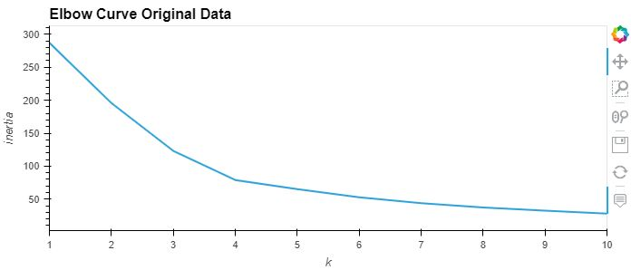

# Project Title

In this project, crypto currencies are clusterd by their performance in different time periods.  Unsupervised learing methods are used to find the best "k"

values for the data, fit and predict a model vor thew data, and then displayed the results through a scatter plot.  The original data is then optimized with 

Principal Component Analysis. A new  "k" value is then found and the results are again displayed on a scatter plot.

---

<br/>

## Technologies

<br/>

This project uses Python 3.9.7 and the following libraries - 

<br/>

| Library | Version | Documentation
|----|----|---|
| pandas |1.4.2| [pandas docs](https://pandas.pydata.org/docs)
| hvplot |0.8.0| [hvplot docs](https://hvplot.holoviz.org/)
| scikit-learn |1.1.1| [scikit-learn docs](https://scikit-learn.org/stable/)

---

<br/>

## Installation Guide

<br/>

```
import pandas as pd

import hvplot.pandas

from sklearn.cluster import KMeans

from sklearn.decomposition import PCA

from sklearn.preprocessing import StandardScaler
```
---

---

<br/>

## Usage

<br/>

The best "k" value was found for the original data and the PCA data.  Both both sets were then plotted using these "k" values.

<br/>

|<p align="center">Elbow Curve of Original Data</p>|<p align="center">Scatter Plot of Original Data</p>|
|---|---|
|<p align="center"></p>|<p align="center">
|<p align="center">**Elbow curve for PCA Data**</p>|<p align="center">**Scatter Plot of PCA Data**</p>|
|<p align="center">|<p align="center">|

---

<br/>

## Contributors

Dan McQueen

dandmcqueen@gmail.com

[Linkedin](https://www.linkedin.com/in/dan-mcqueen-4a5980238/)

---

<br/>

## License

[GNU v3.0](LICENSE)
